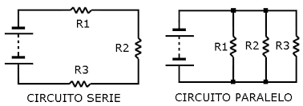
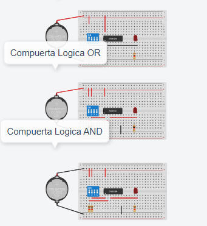
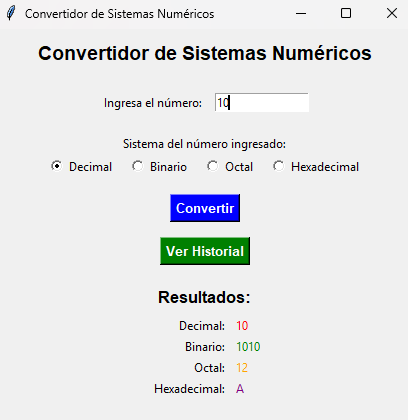
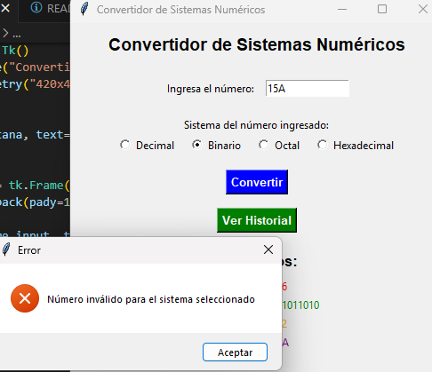
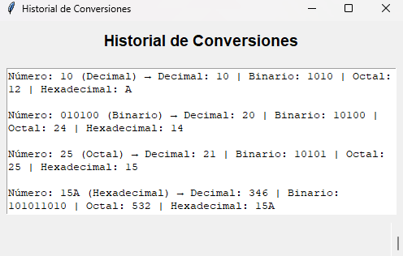

# Trabajos de Desarrollo de Software - Josué Jácome

Este repositorio contiene los trabajos del instituto **Itecsur** relacionados con la asignatura de **Desarrollo de Software** con la materia de Electrónica y sistemas digitales . Incluye enlaces a las páginas principales, deberes y actividades realizadas.

## Página Principal

Puedes acceder a la página principal desde [este enlace](https://deinszxcq.github.io/Deberes/):

En la página principal encontrarás botones para acceder a los diferentes apartados:

- [Deberes](deberes.html)  
- [Actividades](actividades.html)  

### 📄 [Deber 1: Análisis y Simulación de Compuertas Lógicas Básicas (AND, OR y NOT)](https://deinszxcq.github.io/Deberes/Primerdeber.html)
En este trabajo se analiza cómo funcionan las compuertas lógicas básicas **AND, OR y NOT** y se realiza su simulación, mostrando su comportamiento en diferentes combinaciones de entradas para comprender su funcionamiento en circuitos digitales.  

### ⚙️ [Deber 2: Simulación de circuitos en serie y en paralelo](https://deinszxcq.github.io/Deberes/Segundodeber.html)
Se simulan circuitos eléctricos en **serie y en paralelo** para estudiar la distribución de corriente y voltaje en cada componente, aprendiendo a diferenciar el comportamiento de los circuitos según su configuración.  

### 💡 [Deber 3: Informe: Conversión entre Sistemas Numéricos](https://deinszxcq.github.io/Deberes/Tercerdeber.html)
Se realiza un informe explicando la **conversión entre sistemas numéricos** (binario, decimal y hexadecimal), mostrando ejemplos prácticos de cómo transformar un número de un sistema a otro de manera correcta y rápida.  

---

## Actividades

### 1️⃣ [Análisis y Simulación de Compuertas Lógicas Básicas (AND, OR y NOT) en Tinkercad](https://deinszxcq.github.io/Deberes/Actividad1.html)
Se analiza y simula el funcionamiento de las compuertas lógicas básicas **AND, OR y NOT** usando Tinkercad para observar cómo cambian las salidas según las entradas.  

### 2️⃣ [ Encender un foco según la distancia](https://deinszxcq.github.io/Deberes/Actividad2Arduino.html)
Proyecto en Arduino que enciende un foco si la distancia medida por un sensor ultrasónico es mayor a 100 cm, y enciende otro foco si es menor.  

### 3️⃣ [Visualización en Pantalla LCD con Caracteres Personalizados](https://deinszxcq.github.io/Deberes/Actividad3Lcd.html)
Sistema que muestra información en una **pantalla LCD** con caracteres personalizados, aprendiendo a controlar el display y crear mensajes personalizados en Arduino.  

### 3.1️⃣ [Sistema integrado con Arduino y sensor ultrasónico](https://deinszxcq.github.io/Deberes/Actividad3Lcd.html)
Proyecto que mide la distancia con un **sensor ultrasónico**, muestra la información en tiempo real en una **pantalla LCD**, y además activa un **LED o alarma** según la medición.  

### 4️⃣ [Sistema de inicio de sesión con verificación de contraseña con LCD ](https://deinszxcq.github.io/Deberes/Actividad4.html)
Proyecto que implementa un sistema de inicio de sesión usando Arduino y pantalla LCD, donde se verifica la contraseña ingresada y muestra mensajes según el resultado.  

---

## Examen Final

### Conversor de Sistemas Numéricos
Este proyecto consiste en un **conversor de números** que permite transformar valores entre **decimal, binario, octal y hexadecimal**. Incluye manejo de errores al ingresar datos incorrectos y guarda un **historial** de las conversiones realizadas para consulta posterior.  

*Ejemplo de conversión de un número entre decimal, binario, octal y hexadecimal.*

  

*Ejemplo de cómo se muestra un error al ingresar un dato inválido.*

*Historial que guarda las conversiones realizadas para poder consultarlas después.*
